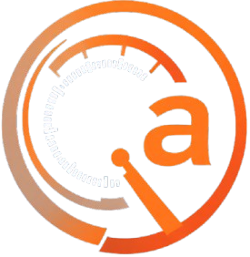

# 🚗 Quernel Auto - Plateforme d'Import/Export de Véhicules

<div align="center">
  
  
  [](https://symfony.com/)
  [](https://php.net/)
  [](https://www.mysql.com/)
  [](https://www.docker.com/)
  [](https://stripe.com/)
  
  **Plateforme moderne d'import/export de véhicules avec paiements sécurisés**
</div>

---

## 🎯 À Propos

**Quernel Auto** est une plateforme web moderne développée avec Symfony 6, spécialisée dans l'import et l'export de véhicules à l'international. Notre solution offre une expérience utilisateur fluide et sécurisée pour l'achat et la vente de véhicules de qualité.

### ✨ Fonctionnalités Principales
- 🚗 **Catalogue de véhicules** avec recherche avancée
- 👤 **Gestion des utilisateurs** et profils personnalisés
- 💳 **Paiements sécurisés** via Stripe
- 📧 **Système de contact** et notifications
- 🛠️ **Interface d'administration** complète
- 📱 **Design responsive** optimisé mobile

---

## 🚀 Démarrage Rapide

### Installation
```bash
# Cloner le repository
git clone https://github.com/MorvinQUERNEL/symfony_quernel-auto.git
cd symfony_quernel-auto/app

# Installer les dépendances
composer install

# Configurer l'environnement
cp .env .env.local
# Éditer .env.local avec vos paramètres

# Créer la base de données
php bin/console doctrine:database:create
php bin/console doctrine:migrations:migrate

# Créer un super admin
php bin/console app:make-super-admin admin@quernel-auto.com

# Démarrer le serveur
symfony server:start
```

### Accès
- **Application** : http://localhost:8000
- **Administration** : Connectez-vous avec votre compte admin

---

## 📁 Structure du Projet

```
symfony_quernel-auto/
├── app/                    # Application Symfony principale
│   ├── src/               # Code source
│   ├── templates/         # Templates Twig
│   ├── public/            # Assets publics
│   ├── config/            # Configuration
│   └── migrations/        # Migrations Doctrine
├── docs/                  # Documentation
├── docker-compose.yaml    # Configuration Docker
└── README.md             # Ce fichier
```

---

## 🔧 Technologies Utilisées

- **Backend** : Symfony 6.4+, PHP 8.1+, MySQL 8.0+
- **Frontend** : Twig, CSS3, JavaScript ES6+, Font Awesome
- **Paiements** : Stripe
- **Emails** : Symfony Mailer
- **Containerisation** : Docker
- **Versioning** : Git

---

## 📖 Documentation Complète

Pour une documentation détaillée, consultez le [README complet dans le dossier `app/`](app/README.md).

### Sections Disponibles
- 🎯 [À Propos](app/README.md#-à-propos)
- ✨ [Fonctionnalités](app/README.md#-fonctionnalités)
- 🏗️ [Architecture](app/README.md#️-architecture)
- 🚀 [Installation](app/README.md#-installation)
- ⚙️ [Configuration](app/README.md#️-configuration)
- 📱 [Utilisation](app/README.md#-utilisation)
- 🔧 [Développement](app/README.md#-développement)
- 📊 [Structure du Projet](app/README.md#-structure-du-projet)
- 🤝 [Contribution](app/README.md#-contribution)

---

## 🐳 Docker (Optionnel)

```bash
# Démarrer avec Docker
docker-compose up -d

# Accéder à l'application
http://localhost:8080

# Mailhog (emails)
http://localhost:8025
```

---

## 📞 Contact

- **Email** : contact@quernel-auto.com
- **Site Web** : https://quernel-auto.com
- **GitHub** : https://github.com/MorvinQUERNEL/symfony_quernel-auto

---

<div align="center">
  <p>Développé avec ❤️ par Morvin Quernel</p>
  <p>🚗 Simplifions l'import/export de véhicules ensemble !</p>
</div>
